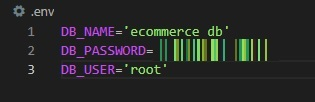
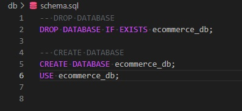

# E-commerce-backend

## Video Walkthrough: https://drive.google.com/file/d/1gFjjX9-vBiM0ZEB6FBLv1t4LnjpKy-tw/view

This project is a database of products, tags, and categories, with both many-to-many and one-to-many relations, that could be used by an e-commerce company. 

The program uses Sequelize to build models for products, tags, and categories, and uses a ProductTag model to connect products with tags. 

It uses a .env file to store environment variables so that the login information for MySQL does not need to be hardcoded and can therefore be protected.

In order to run the program, a user needs to execute the schema file using MySQL and then run index.js from the seeds folder followed by server.js. All kinds of HTTP requests can then be made from a browser or Insomnia.

